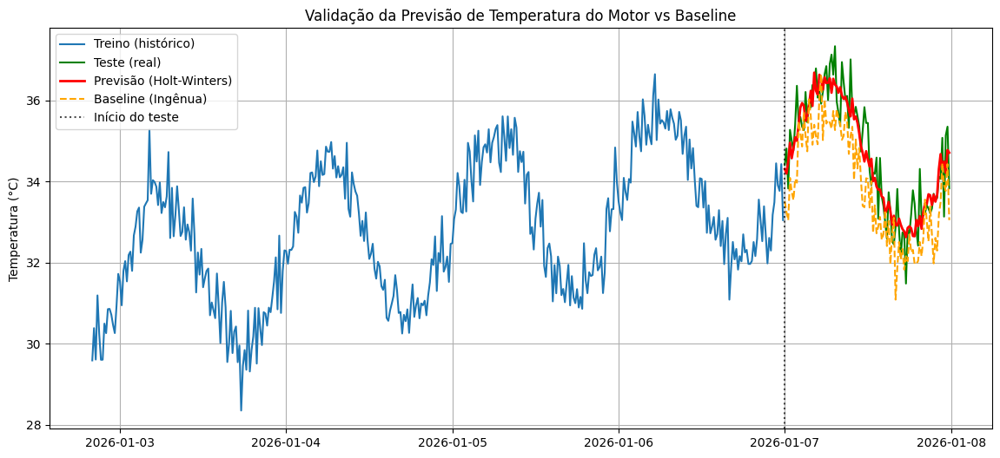

# Time Series Forecasting — Holt-Winters

This project demonstrates, in an educational approach, how to **generate a synthetic time series** (operational temperature of an engine) and apply a **Holt-Winters Exponential Smoothing** model to **forecast the next 24 hours** based on historical patterns of **trend** and **daily seasonality**.

> Note: The data used is **synthetic** (simulated) for study and method validation purposes.

---

## Visualization

The image below shows the comparison between the **actual test data** and the **model's forecast**, highlighting the daily seasonal behavior.

---

## Objective

- Simulate temperature measurements at regular intervals (every **15 minutes**).
- Model the series considering:
  - **Trend** (gradual growth)
  - **Seasonality** (daily cycle)
  - **Noise** (random variation)
- Train a **Holt-Winters** model and evaluate the forecast.
- Compare the model against a **Seasonal Naive baseline**.

---

## Methodology (Summary)

1. **Timeframe generation**: 7 days with a 15-minute frequency.
2. **Series composition**:
   - Linear trend (e.g., 30 → 35 °C)
   - Sinusoidal seasonality with a daily period (96 points per day)
   - Gaussian noise (with `np.random.seed(42)` for reproducibility)
3. **Temporal Split**:
   - Train: First 6 days
   - Test: Last 24h (96 points)
4. **Models**:
   - **Holt-Winters** (additive trend + additive seasonality)
   - **Seasonal Naive baseline** (repeats the last 24h of the training set)
5. **Evaluation Metrics**:
   - MAE
   - RMSE
   - MAPE

---

## Main Results

In the notebook, the Holt-Winters model achieved **lower errors** than the naive baseline. This indicates that the predictive model successfully captured the **trend + seasonality**, whereas the baseline tends to simply "copy" the previous day and fails to track the continuous trend.

*(Exact values may vary if you change parameters, timeframe, noise, or the random seed.)*

---

## Technologies & Libraries

- **Python**
- **NumPy** (signal and noise generation)
- **Pandas** (time series and tabular manipulation)
- **Matplotlib** (visualization)
- **statsmodels** (Holt-Winters / ExponentialSmoothing)
- **scikit-learn** (MAE, RMSE, MAPE)

---

## How to Run

1. Open the **`time_series_forecasting.ipynb`** file (e.g., in Google Colab or Jupyter).
2. Run the cells in sequential order.

## PNAAT

This notebook was developed by applying the knowledge acquired from the **PNAAT training course — Predictive Analysis of Sensor Data**.

---
